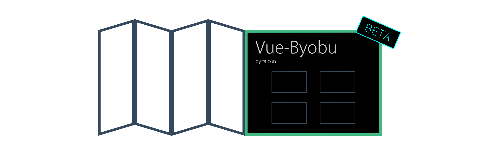
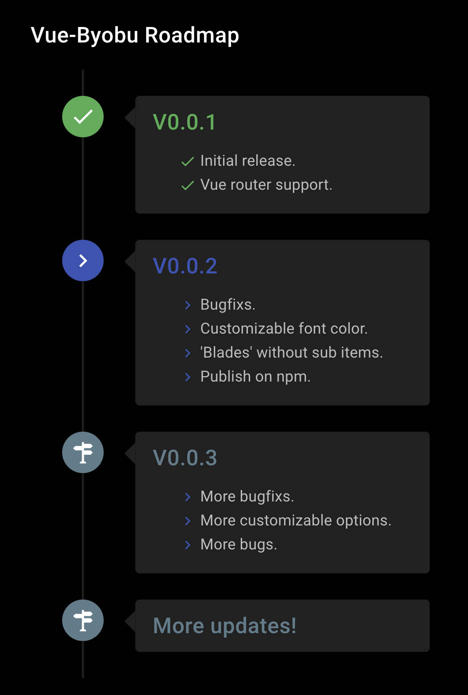

# Vue-Byōbu
> Byōbu (屏風) (lit., "wind wall") are Japanese folding screens made from several joined panels, bearing decorative painting and calligraphy, used to separate interiors and enclose private spaces, among other uses.
>
> -- <cite>Wikipedia</cite>

## About
Vue-Byōbu is a beautiful, customizable, byobu-inspired menu designed for VueJS.

## Preview

## Features
- Nested-structured menu items.
- Customizable background for both parent and child items.
- Vue Router supported.

## Roadmap

## How to
- Coming soon!